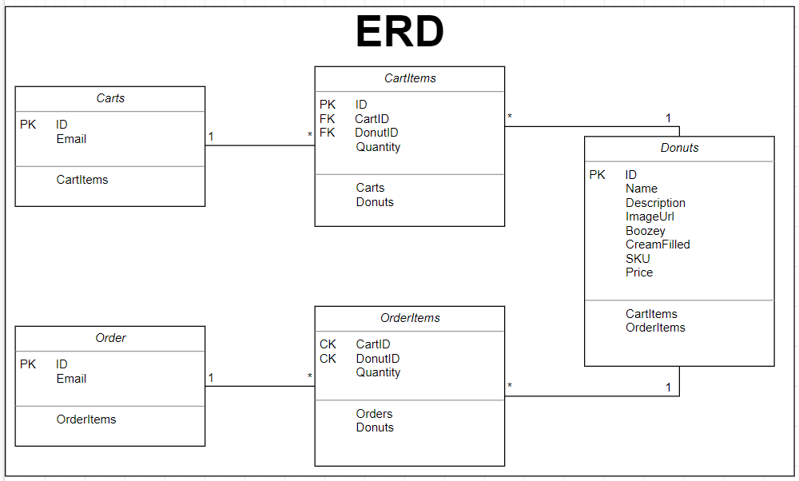

# C&J Donuts

*Authors: Chris Cummings, Jonathan Rice*

----

### Azure Deployment: https://cnjdonuts.azurewebsites.net/

## Description
This app is a mock E-Commerce store created to familiarize ourselves with
ASP.NET Core 3.0 and how an e-commerce store would use these tools.

---

## Tools Used
Microsoft Visual Studio Community 2019 (Version 16.3.6)

- C#
- ASP.Net Core 3.0
- MVC
- Azure
- SQL Database
- Entity Framework Core
- Identity

---

## Diagrams

Carts and CartItems tables reflect what is currently in the cart. Each user has a new cart instantiated for them
upon registration which is called based on their login email.  The CartItems hold reference to the cart they are in,
as well as the ID of the Donut they are referencing.

The donut table holds the main products, including the properties associated with each donut.

The Orders and OrderItems tables function very similarly to the Carts and CartItems, but they are meant more for
long term storage. CartItems are removed upon order, and an order is generated to store upon purchase.

---

## Description

The product of the ecommerce store is donuts. We decided on donuts because they are delicious.

Accounts can be created via Windows Identity. The accounts are stored in
a specific user database. On registration, claims for first name, birthdate
and email are added. First name is captured for a personalized greeting. Age is captured to see if the member is over 21.
Email is captured for email and access purposes.

Admin roles are added through validation of email being @admin.com. Admins have the ability to add, remove or edit
products in the database. Users should not be allowed to edit the inventory, so that policy is established. 

---

### Visuals

TBD

---

### Change Log 

*1.0 Finished sprint 1. 11/25/19*

*1.1 Finished sprint 2. 12/03/19*

